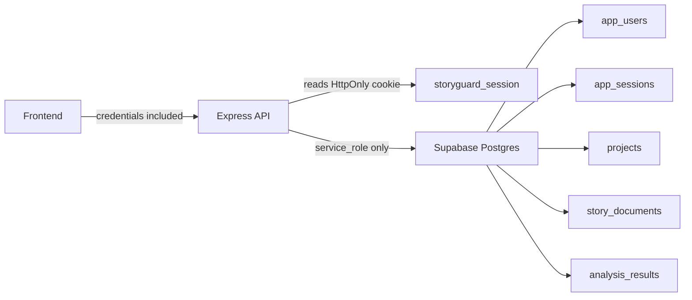
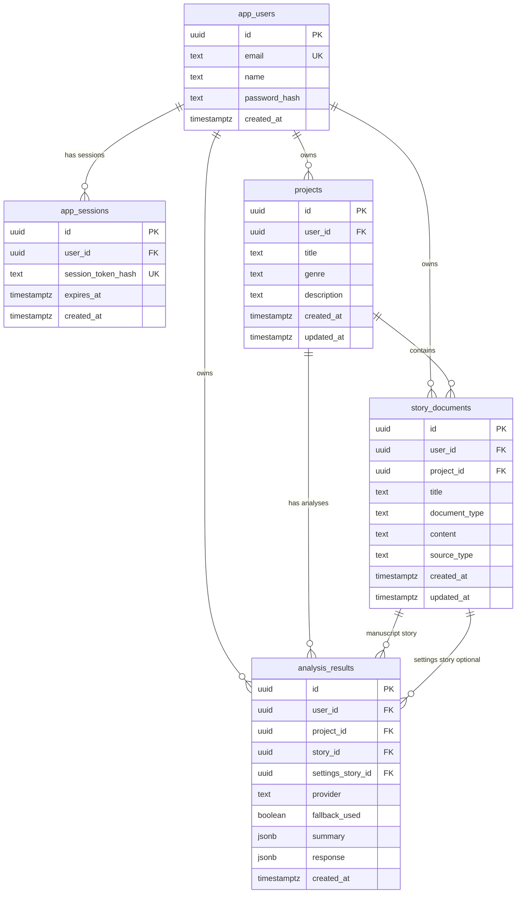

# Database Architecture

StoryGuard MVP uses Supabase Postgres as the database, but it does not expose Supabase directly to the frontend.

Frontend calls the Express API. The Express API authenticates the user with an HttpOnly cookie, then queries Supabase with the backend-only service role key. Real secrets live outside the repository in `C:\Secrets\storyguard.env`.

## Access Model



## ERD



## Security Notes

- RLS is enabled on all app tables.
- No RLS policies are created for `anon` or `authenticated` roles in the MVP.
- `anon` and `authenticated` privileges are revoked from app tables.
- `service_role` has explicit table access for backend-only CRUD.
- The frontend must not call Supabase directly for these tables.
- The backend must add `user_id = currentUser.id` filters to every project, story, and analysis query.
- The `SUPABASE_SERVICE_ROLE_KEY` must stay server-side only.

Supabase may show `RLS Enabled No Policy` as an info-level advisor. For this MVP architecture, that is intentional because custom session auth is enforced by the Express backend.

## Useful SQL

Postgres does not support MySQL-style `show tables;`. Use this instead in Supabase SQL Editor:

```sql
select table_schema, table_name
from information_schema.tables
where table_schema = 'public'
order by table_name;
```

To inspect columns:

```sql
select table_name, column_name, data_type
from information_schema.columns
where table_schema = 'public'
order by table_name, ordinal_position;
```
